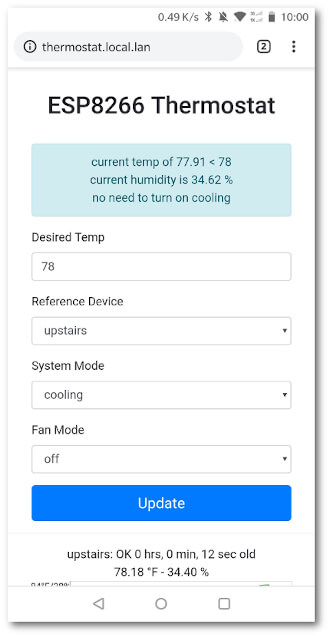

# ESP8266 Thermostat System

This came out of the desire to have both remote and finer grain control of our heating and cooling system.
Specifically for multi-floor houses with a single heating and cooling system it might be desirable to cool in respect to the top, ground, or basement floors.
This of course isn't achievable in a single thermostat system, and thus a multi-sensor system that reports to central controller architecture was born.

### Key Features

* Web-based interface for thermostat
* Selection of what temperature "device" to cool to
* Historical views of temperature and humidity
* Remote control of thermostat if paired with VPN

### Client Devices

These client devices have a simple task of just reporting the current temperature and humidity to the central device.
These leverage the DHT22 sensors, which I have found seem to have very poor initial calibration.
I am not sure of the best way to calibrate them, but for now just using a known good sensor and "offset" the current sensor readings to it.

* [ESP8266 ESP-01 AM2302 DHT22 Temperature Humidity Sensor WiFi Wireless Module Set](https://www.amazon.com/gp/product/B07L6CYFT9/)
* [ESP-01S USB to ESP8266 ESP-01S Wireless Wifi Adapter Module](https://www.amazon.com/gp/product/B07KF119YB/)
* [3.3V 1A AC Adapter to DC Power Adapter, 5.5 / 2.1 mm](https://www.amazon.com/gp/product/B07BGW2VXV/)
* [12V DC Power Connector 5.5mm x 2.1mm 24V Power Jack Socket](https://www.amazon.com/gp/product/B079R9WCG2/)
* [70cm 2 Pin Female to Female Dupont Jumper Wire Cable](https://www.amazon.com/gp/product/B07CPS72RR/)

### Server Device

The server device serves the webpage that provides user feedback, temperature information, and allow for setting of desired temperature.
This will be located near the actual cooling unit and uses a set of relays to turn on and off the fan, heat, and cooling functions.
The wiring that I used for my US-based heater/cooling unit was the following:

* R - 24VAC
* G - Fan/Blower
* Y - Cool/Compressor
* W - Heat

To "enable" one of the functions, have the relay connect the 24VAC wire with the desired function. I wired the system so that these are "normally open" (NO) so that if the device lost power the heater/cooling unit failed gracefully.
There is a pretty nice pre-made four relay system on amazon that I used, but one could easliy build one and trigger using a ESP8266 form factor that exposes enough GPIO pins.

* [LinkSprite 211201004 Link Node R4 Arduino-Compatible Wi-Fi Relay Controller](https://www.amazon.com/gp/product/B01NB0XJ0F/)
* [AC 100-240V to DC 5V 2A Power Supply Adapter](https://www.amazon.com/gp/product/B0719GY29M/)

### Afterthoughts 

The one battle that I am still fighting is the calibration of the client devices.
I think that I need to research a better way to calibrate these and maybe allow for me to set their calibration offsets through a web interface would allow for updating of their values more easily.

