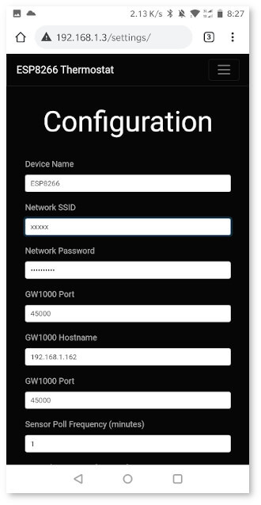

# ESP8266 Thermostat System

This came out of the desire to have both remote and finer grain control of our heating and cooling system.
Specifically for multi-floor houses with a single heating and cooling system it might be desirable to cool in respect to the top, ground, or basement floors.
This of course isn't achievable in a single thermostat system, and thus a multi-sensor system that reports to central controller architecture was born.

* [**Client and Server Version 1**](ReadMe_V1.md): This was the original project that used multiple ESP8266 for both small sensor devices and a central server which controlled the heating / cooling unit. Some of the issues with this original code is that the calibration of the sensors was difficult even after doing a calibration procedure.

* [**Client and Server Version 2**](ReadMe_V2.md): The current codebase that I use. This has a lot more functionality including a 24 hour schedule, settings, and statistics to compare with your electrical bill. This solves the sensor problem by using an Ecowitt GW1000 gateway to get nice temperature and humidity information from their sensors. Works really well and is reasonably affordable for the quality of sensors (about $35 for the gateway, and $20 per additional sensors).

## Example Screenshots (server v2)

