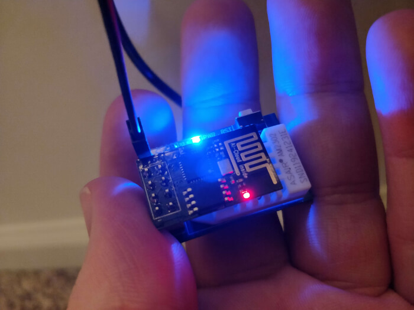
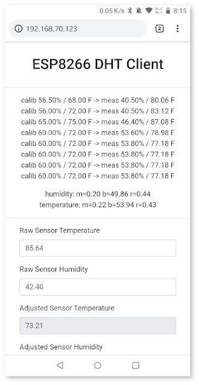

# ESP8266 Thermostat System V1

This came out of the desire to have both remote and finer grain control of our heating and cooling system.
Specifically for multi-floor houses with a single heating and cooling system it might be desirable to cool in respect to the top, ground, or basement floors.
This of course isn't achievable in a single thermostat system, and thus a multi-sensor system that reports to central controller architecture was born.
Overall the project costs about $100 for four remote sensing devices, a four relay central server, power and programing adapters.
See below for interface screenshots!!

## Key Features

* Web-based interface for thermostat
* Selection of what temperature "device" to cool to
* Historical views of temperature and humidity
* Remote control of thermostat if paired with VPN
* This requires a series of remove "clients" to send data to the server
* Calibration of remote devices through best fit

## Dependencies

* Board Library - https://github.com/esp8266/Arduino
* DHTesp - https://github.com/beegee-tokyo/DHTesp
* ESPAsyncWebServer - https://github.com/me-no-dev/ESPAsyncWebServer
* ESPAsyncTCP - https://github.com/me-no-dev/ESPAsyncTCP

## Server Device

The server device serves the webpage that provides user feedback, temperature information, and allow for setting of desired temperature.
This will be located near the actual cooling unit and uses a set of relays to turn on and off the fan, heat, and cooling functions.
This server should have a static IP address and be configured to connect to your SSID network.
The wiring that I used for my US-based heater/cooling unit was the following:

* R - 24VAC
* G - Fan/Blower
* Y - Cool/Compressor
* W - Heat

To "enable" one of the functions, have the relay connect the 24VAC wire with the desired function.
I wired the system so that these are "normally open" (NO) so that if the device lost power the heater/cooling unit failed gracefully.
There is a pretty nice pre-made four relay system on amazon that I used, but one could easily build one and trigger using a ESP8266 form factor that exposes enough GPIO pins.

* [LinkSprite 211201004 Link Node R4 Arduino-Compatible Wi-Fi Relay Controller](https://www.amazon.com/dp/product/B088BHFVQK/)
* [AC 100-240V to DC 5V 2A Power Supply Adapter](https://www.amazon.com/dp/product/B082D97W98/)
* [5pin 18 Gauge Thermostat Wire](https://www.amazon.com/dp/product/B0069F4HHC/)

## Client Devices

These client devices have a simple task of just reporting the current temperature and humidity to the central device.
These leverage the DHT22 sensors, which I have found seem to have very poor initial calibration.
I am not sure of the best way to calibrate them, but for now just using a known good sensor and "offset" the current sensor readings to it.
For now calibration values can be set that map the raw values into the calibrated values.
These are fitted using a linear regression to find the best correspondence between the read and calibrated values.
You will want to assign a static IP to your server device and then input this into each client so that they can report their temperature readings to it.
You will also need to configure the SSID and password for your wireless router so that the ESP8266 can connect.

* [ESP8266 ESP-01 AM2302 DHT22 Temperature Humidity Sensor WiFi Wireless Module Set](https://www.amazon.com/gp/product/B07L6CYFT9/)
* [ESP-01S USB to ESP8266 ESP-01S Wireless Wifi Adapter Module](https://www.amazon.com/gp/product/B07KF119YB/)
* [3.3V 1A AC Adapter to DC Power Adapter, 5.5 / 2.1 mm](https://www.amazon.com/gp/product/B07BGW2VXV/)
* [12V DC Power Connector 5.5mm x 2.1mm 24V Power Jack Socket](https://www.amazon.com/gp/product/B079R9WCG2/)
* [70cm 2 Pin Female to Female Dupont Jumper Wire Cable](https://www.amazon.com/gp/product/B07CPS72RR/)

## Afterthoughts 

The calibration still seems to be a weak point, but for now it should perform as expected if there is a linear mapping.
I am unsure if this actually will save anything on the electric bill, but the convenience factor of being able to access on my phone is a big "win" in my books.
I think that some more intelligent choices on when to enable and if we should cool/heat past the desired temperature is an interesting future direction.
The original idea was to stick a neural network on this, but due to the ESP8266 small size and slow execution this probably is not possible in practice.
Would still be an interesting to try to improve cost savings through optimization-based methods and predicted outdoor temperature trends.

