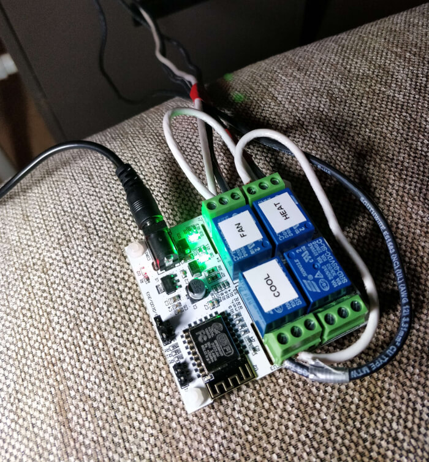
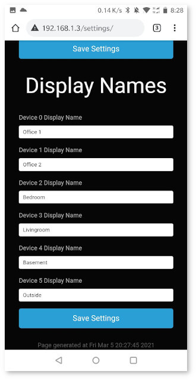

# ESP8266 Thermostat System V2

This came out of the desire to have both remote and finer grain control of our heating and cooling system.
Specifically for multi-floor houses with a single heating and cooling system it might be desirable to cool in respect to the top, ground, or basement floors.
This of course isn't achievable in a single thermostat system, and thus a multi-sensor system that reports to central controller architecture was born.
Overall the project costs about $100 for four remote sensing devices, a four relay central server, power and programing adapters.
See below for interface screenshots!!

## Key Features

* Web-based interface for thermostat
* Integrates with [Ecowitt GW1000](https://www.ecowitt.com/shop/goodsDetail/16) gateway sensors
* Selection of what temperature "device" to cool to
* Historical record of how long AC / Heat / Fan was on
* Historical sensor information (only one is shown on stats page for now)
* 24 schedule of what device, temp, and fan status should be
* Settings page for changing and saving configuration
* Access point mode for easy setup (CSS styling needs to be fixed still)
* Day and night CSS style mode for easy viewing

## Dependencies

* ESPAsyncWebServer - https://github.com/me-no-dev/ESPAsyncWebServer
* ESPAsyncTCP - https://github.com/me-no-dev/ESPAsyncTCP

## Server Device

The server device serves the webpage that provides user feedback, temperature information, and allow for setting of desired temperature.
This will be located near the actual cooling unit and uses a set of relays to turn on and off the fan, heat, and cooling functions.
The wiring that I used for my US-based heater/cooling unit was the following:

* R - 24VAC
* G - Fan/Blower
* Y - Cool/Compressor
* W - Heat

To "enable" one of the functions, have the relay connect the 24VAC wire with the desired function.
I wired the system so that these are "normally open" (NO) so that if the device lost power the heater/cooling unit failed gracefully.
There is a pretty nice pre-made four relay system on amazon that I used, but one could easily build one and trigger using a ESP8266 form factor that exposes enough GPIO pins.

* [Ecowitt GW1000 Wifi Gatway](https://www.amazon.com/ECOWITT-Weather-Temperature-Humidity-Pressure/dp/B082LZTY1H)
* [Ecowitt WH31E Sensor](https://www.amazon.com/Ambient-Weather-Sensor-WS-3000-Station/dp/B01MG4HW8C/)
* [LinkSprite 211201004 Link Node R4 Arduino-Compatible Wi-Fi Relay Controller](https://www.amazon.com/dp/product/B088BHFVQK/)
* [AC 100-240V to DC 5V 2A Power Supply Adapter](https://www.amazon.com/dp/product/B082D97W98/)
* [5pin 18 Gauge Thermostat Wire](https://www.amazon.com/dp/product/B0069F4HHC/)

Main Screen:

Statistics Screen:

Settings Screen:

## Afterthoughts 

Overall this is a really great system that provides all the information and control that I need.
If there was one thing it would be I need to add support for an SD card to save the historical data to,
and also support serving of the style sheets instead of from the internet.

